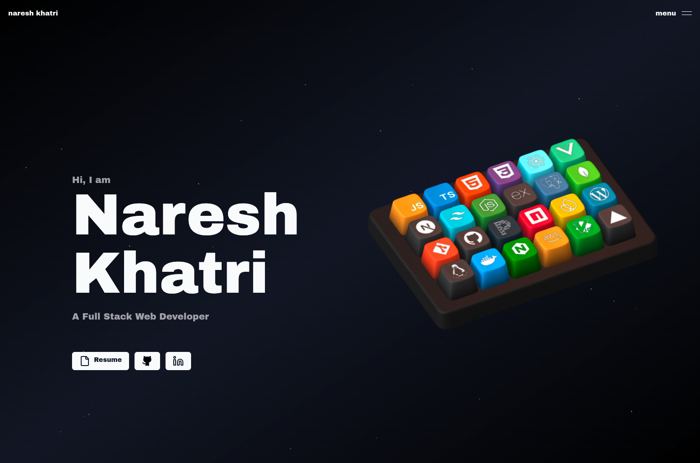

# Kejal Jain | 3D Interactive Portfolio

Welcome to my interactive 3D portfolio! This project showcases my work, skills, and experience as a Full Stack Developer and AIML Enthusiast.

## 🚀 Features
- Modern, animated 3D UI
- Responsive design for all devices
- Project gallery with image slideshows
- About, Skills, and Contact sections
- Social media integration

## 🛠️ Tech Stack
- **Frontend:** React.js, Next.js, TailwindCSS, Framer Motion
- **Backend:** Node.js, Express.js, MongoDB
- **Other:** TypeScript, Vercel, GitHub Actions

## 📸 Screenshots


## 📝 Getting Started

1. **Clone the repository:**
   ```bash
   git clone https://github.com/kejal2005/My_portfolio.git
   cd My_portfolio
   ```
2. **Install dependencies:**
   ```bash
   npm install
   ```
3. **Run the development server:**
   ```bash
   npm run dev
   ```
4. Open [http://localhost:3000](http://localhost:3000) to view it in your browser.

## 📬 Contact
- **Email:** kejal22jain@gmail.com
- **LinkedIn:** [kejal-jain](https://www.linkedin.com/in/kejal-jain)
- **GitHub:** [kejal2005](https://github.com/kejal2005)

---

> Made with ❤️ by Kejal Jain 